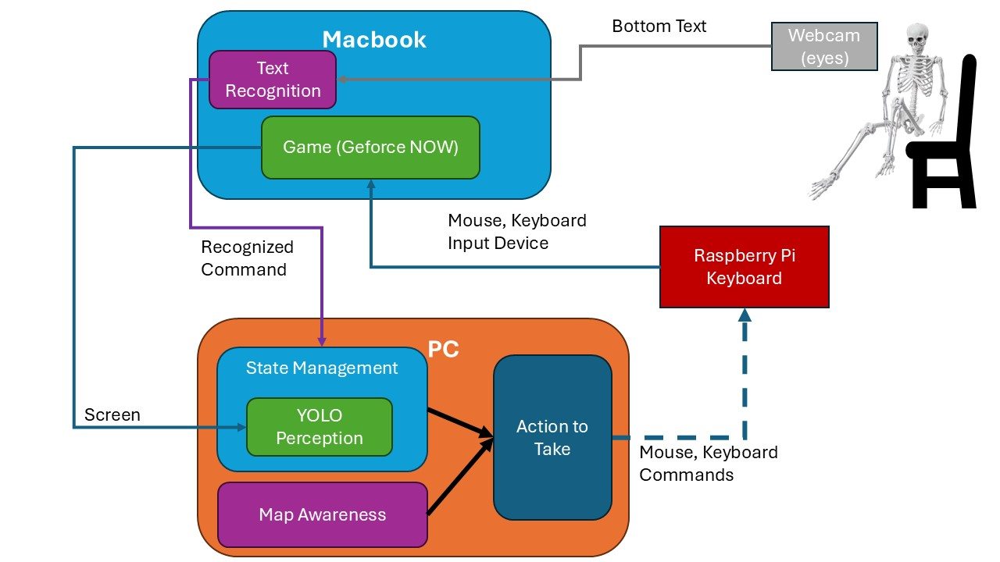
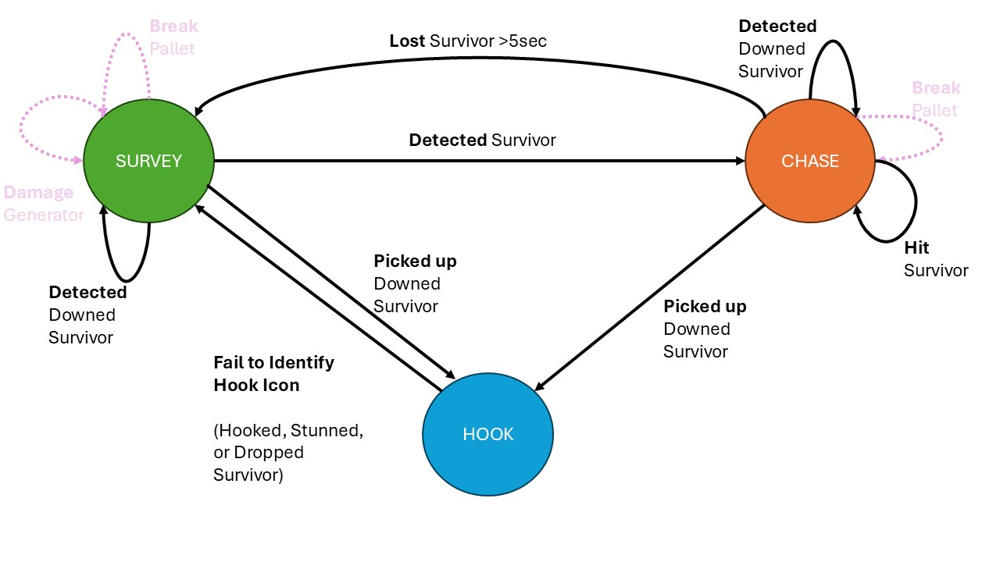

Dead By Daylight Killer AI
==============================

An Object detection and tracking model for a killer in Dead by Daylight. This repo's goal is stand up an AI that will hunt, chase, kill, and hook survivors that are identified while navigating between generators without any human input. 

Object detection is done using a [Yolov8](https://docs.ultralytics.com/) model. Labeling was done manually through [Roboflow](roboflow.com). Text detection is accomplished using [EasyOCR](https://github.com/JaidedAI/EasyOCR).

## Milestones

1. Chase one survivor, hit them twice, and hook the survivor (no RL).
2. Determine how far objects are. Make a minimap
2. Train a model to navigate using RL. It should use our distances.
4. Setup continuous RL training.
5. Have it win against bots. At least 2-3 kills.
6. Face off against Twitch Streamers.

## System Diagram:

### State Diagram:

## What this repository does:

- [ ] Object Detection
    - [x] Generators
    - [X] Pallets
    - [x] Hooks
    - [X] Survivors
    - [X] Downed Survivors
    - [X] Activity
    - [X] Exit Gate
    - [ ] Hatchets (Huntress)
    - [ ] Traps (Trapper)
- [ ] Track Survivors that actively move in the environment using DeepSORT.
- [ ] Build a map from stationary, key generators and hooks.
- [ ] Navigate to generators and survey them for survivors.
- [ ] Chase and hit survivors until they are down.
- [ ] Pickup a survivor, navigate to a hook, and hook a survivor.
- [ ] Be able to switch between states:
    - [ ] Survey (Generators, Activity)
    - [ ] Chase
    - [ ] Hook
- [ ] Include a priority queue for switching between states and performing certain actions.
- [ ] **TBD**

## How the Killer actually moves

**TBD**
The killer moves through `pyautogui` to issue commands in order to move about the environment.

## Setup Guide

**TBD**

-----------
Project Organization
------------

    ├── LICENSE
    ├── Makefile           <- Makefile with commands like `make data` or `make train`
    ├── README.md          <- The top-level README for developers using this project.
    ├── data
    │   ├── external       <- Data from third party sources.
    │   ├── interim        <- Intermediate data that has been transformed.
    │   ├── processed      <- The final, canonical data sets for modeling.
    │   └── raw            <- The original, immutable data dump.
    │
    ├── docs               <- A default Sphinx project; see sphinx-doc.org for details
    │
    ├── models             <- Trained and serialized models, model predictions, or model summaries
    │
    ├── notebooks          <- Jupyter notebooks. Naming convention is a number (for ordering),
    │                         the creator's initials, and a short `-` delimited description, e.g.
    │                         `1.0-jqp-initial-data-exploration`.
    │
    ├── references         <- Data dictionaries, manuals, and all other explanatory materials.
    │
    ├── reports            <- Generated analysis as HTML, PDF, LaTeX, etc.
    │   └── figures        <- Generated graphics and figures to be used in reporting
    │
    ├── requirements.txt   <- The requirements file for reproducing the analysis environment, e.g.
    │                         generated with `pip freeze > requirements.txt`
    │
    ├── setup.py           <- makes project pip installable (pip install -e .) so src can be imported
    ├── src                <- Source code for use in this project.
    │   ├── __init__.py    <- Makes src a Python module
    │   │
    │   ├── data           <- Scripts to download or generate data
    │   │   └── make_dataset.py
    │   │
    │   ├── features       <- Scripts to turn raw data into features for modeling
    │   │   └── build_features.py
    │   │
    │   ├── models         <- Scripts to train models and then use trained models to make
    │   │   │                 predictions
    │   │   ├── predict_model.py
    │   │   └── train_model.py
    │   │
    │   └── visualization  <- Scripts to create exploratory and results oriented visualizations
    │       └── visualize.py
    │
    └── tox.ini            <- tox file with settings for running tox; see tox.readthedocs.io

--------

<small>Project based on the <a target="_blank" href="https://drivendata.github.io/cookiecutter-data-science/">cookiecutter data science project template</a>. #cookiecutterdatascience</small>

